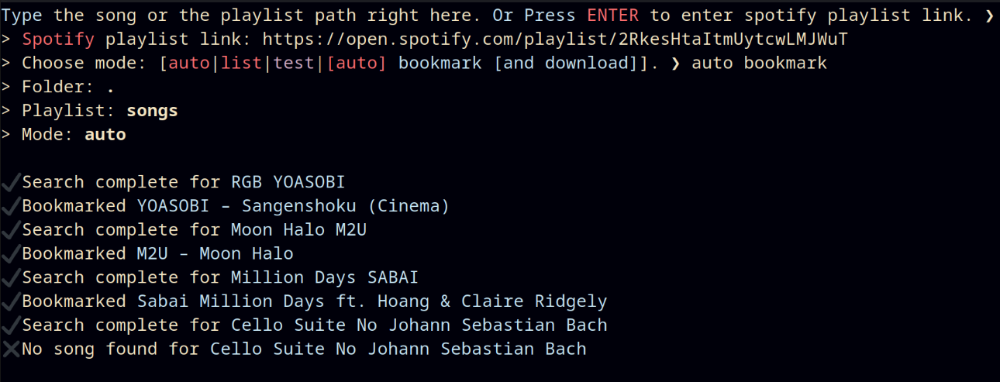

# Move your playlists to Beat Saber! 

`pip3 install saberio-rewind`  
[](https://git.io/typing-svg)  
Using the interactive prompt is suggested for this fork, especially for syncing the playlist from Spotify.

> Your cookie and token will be stored locally once the program is initiated.

```sh
Type the song or the playlist path right here. Or Press ENTER to enter spotify playlist link. ❯ 
> Spotify playlist link: https://open.spotify.com/playlist/2RkesHtaItmUytcwLMJWuT
> Choose mode: [auto|list|test|[auto] bookmark [and download]]. ❯ bookmark
Client ID: 
Secret ID: 
✔ Configuration successful!
> Folder: .
> Playlist: songs
> Mode: list

✔ Search complete for RGB YOASOBI
╒════╤════════╤════════════════════════════════╤════════════════╤══════╤════════╤═════════════════════╤════════════╕
│    │ Code   │ Song                           │ Mapper         │   Up │   Down │ Difficulty          │ Date       │
╞════╪════════╪════════════════════════════════╪════════════════╪══════╪════════╪═════════════════════╪════════════╡
│  1 │ 1a705  │ YOASOBI – Sangenshoku (Cinema) │ citizenfive    │ 1511 │     57 │ Ea, No, Ha, Ex, Ex+ │ 19.07.2021 │
├────┼────────┼────────────────────────────────┼────────────────┼──────┼────────┼─────────────────────┼────────────┤
│  2 │ 16165  │ RGB – YOASOBI                  │ Joetastic      │  437 │     36 │ Ha, Ex, Ex+         │ 30.03.2021 │
├────┼────────┼────────────────────────────────┼────────────────┼──────┼────────┼─────────────────────┼────────────┤
│  3 │ 1ef4b  │ RGB – YOASOBI                  │ Joetastic      │   98 │      9 │ Ex+                 │ 17.12.2021 │
├────┼────────┼────────────────────────────────┼────────────────┼──────┼────────┼─────────────────────┼────────────┤
│  4 │ 160f3  │ YOASOBI – RGB                  │ Dack           │  299 │     34 │ Ex                  │ 30.03.2021 │
├────┼────────┼────────────────────────────────┼────────────────┼──────┼────────┼─────────────────────┼────────────┤
│  5 │ 1a537  │ YOASOBI – RGB                  │ Nolanimations  │   76 │      9 │ Ex+                 │ 16.07.2021 │
├────┼────────┼────────────────────────────────┼────────────────┼──────┼────────┼─────────────────────┼────────────┤
│  6 │ 1669d  │ RGB – YOASOBI                  │ hiyasi_penguin │   66 │      8 │ Ex                  │ 07.04.2021 │
╘════╧════════╧════════════════════════════════╧════════════════╧══════╧════════╧═════════════════════╧════════════╛
✔ Bookmarked RGB – YOASOBI
```


