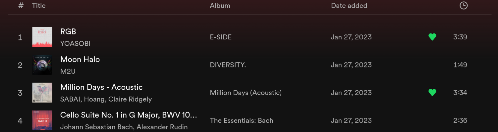
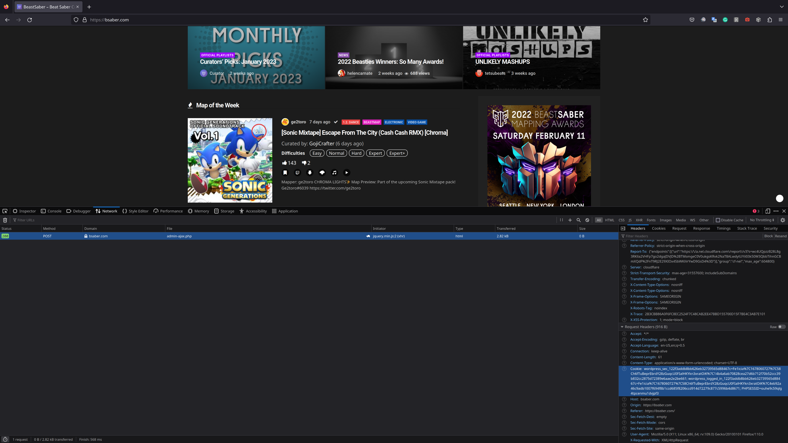

# Move your playlists to Beat Saber! 

`pip3 install saberio-rewind`  
[](https://git.io/typing-svg)  

> Your cookie and token will be only stored locally once the program is initiated.

```sh
Type the song or the playlist path right here. Or Press ENTER to enter spotify playlist link. ❯ 
> Spotify playlist link: https://open.spotify.com/playlist/2RkesHtaItmUytcwLMJWuT
> Choose mode: [auto|list|test|[auto] bookmark [and download]]. ❯ bookmark
Client ID: 
Secret ID: 
✔ Configuration successful!
> Folder: .
> Playlist: songs
> Mode: list

✔ Search complete for RGB YOASOBI
╒════╤════════╤════════════════════════════════╤════════════════╤══════╤════════╤═════════════════════╤════════════╕
│    │ Code   │ Song                           │ Mapper         │   Up │   Down │ Difficulty          │ Date       │
╞════╪════════╪════════════════════════════════╪════════════════╪══════╪════════╪═════════════════════╪════════════╡
│  1 │ 1a705  │ YOASOBI – Sangenshoku (Cinema) │ citizenfive    │ 1511 │     57 │ Ea, No, Ha, Ex, Ex+ │ 19.07.2021 │
├────┼────────┼────────────────────────────────┼────────────────┼──────┼────────┼─────────────────────┼────────────┤
│  2 │ 16165  │ RGB – YOASOBI                  │ Joetastic      │  437 │     36 │ Ha, Ex, Ex+         │ 30.03.2021 │
├────┼────────┼────────────────────────────────┼────────────────┼──────┼────────┼─────────────────────┼────────────┤
│  3 │ 1ef4b  │ RGB – YOASOBI                  │ Joetastic      │   98 │      9 │ Ex+                 │ 17.12.2021 │
├────┼────────┼────────────────────────────────┼────────────────┼──────┼────────┼─────────────────────┼────────────┤
│  4 │ 160f3  │ YOASOBI – RGB                  │ Dack           │  299 │     34 │ Ex                  │ 30.03.2021 │
├────┼────────┼────────────────────────────────┼────────────────┼──────┼────────┼─────────────────────┼────────────┤
│  5 │ 1a537  │ YOASOBI – RGB                  │ Nolanimations  │   76 │      9 │ Ex+                 │ 16.07.2021 │
├────┼────────┼────────────────────────────────┼────────────────┼──────┼────────┼─────────────────────┼────────────┤
│  6 │ 1669d  │ RGB – YOASOBI                  │ hiyasi_penguin │   66 │      8 │ Ex                  │ 07.04.2021 │
╘════╧════════╧════════════════════════════════╧════════════════╧══════╧════════╧═════════════════════╧════════════╛
✔ Bookmarked RGB – YOASOBI
```
# Let's Starting by your Spotify Playlist.



```
❯ saberio -y "https://open.spotify.com/playlist/2RkesHtaItmUytcwLMJWuT"
> Choose mode: [auto|list|test|[auto] bookmark [and download]]. ❯ auto bookmark and download
> Choose a name for the playlist. (songs)❯ 
> Folder: .
> Playlist: songs
> Mode: auto

✔ Search complete for RGB YOASOBI
⚠ YOASOBI – Sangenshoku (Cinema) is by YOASOBI but not sure if its name is RGB...
✔ Bookmarked RGB – YOASOBI
✔ Downloaded RGB – YOASOBI

✔ Search complete for Moon Halo M2U
✔ Bookmarked M2U – Moon Halo
✔ Downloaded M2U – Moon Halo

✔ Search complete for Million Days SABAI
✔ Bookmarked Sabai Million Days ft. Hoang & Claire Ridgely
✔ Downloaded Sabai Million Days ft. Hoang & Claire Ridgely

✔ Search complete for Cello Suite No Johann Sebastian Bach
✖ No song was found for Cello Suite No Johann Sebastian Bach
```

## Or simply tell'em what you you want

```
❯ saberio  -s "RGB--YOASOBI"  -s "Moon Halo--M2U" -s "Million Days"  --auto -b
> Choose a name for the playlist. (songs)❯ 
> Search: ['RGB--YOASOBI', 'Moon Halo--M2U', 'Million Days']
> Folder: .
> Playlist: songs
> Mode: auto

✔ Search complete for RGB YOASOBI
⚠ YOASOBI – Sangenshoku (Cinema) is by YOASOBI but not sure if its name is RGB...
✔ Already downloaded RGB – YOASOBI

✔ Search complete for Moon Halo M2U
✔ Already downloaded M2U – Moon Halo

✔ Search complete for Million Days
✔ Downloaded My Stick! – Bad Lip Reading (Standard, 90 degree)
```

### Or give it a list like this

```
# file ./myloves

RGB--YOASOBI
Moon Halo--M2U
Million Days
```

and

```
❯ saberio  -p loves -f myloves --auto -b
> Songs list file: myloves
> Folder: .
> Playlist: loves
> Mode: auto

✔ Search complete for RGB YOASOBI
⚠ YOASOBI – Sangenshoku (Cinema) is by YOASOBI but not sure if its name is RGB...
✔ Downloaded RGB – YOASOBI

✔ Search complete for Moon Halo M2U
✔ Downloaded M2U – Moon Halo

✔ Search complete for Million Days
✔ Downloaded My Stick! – Bad Lip Reading (Standard, 90 degree)

```

## There can be many combos...
```
❯ saberio  -h
usage: PySaber [-h] [-p PLAYLIST] [-d PATH] [-s SONG | -f FILE | -y SPOTIFY] [-c COOKIE] [-b] [-o] [--auto | --list | --test] [--verbose]

Let's rock on Beat Saber.

options:
  -h, --help            show this help message and exit
  -p PLAYLIST           playlist name
  -d PATH, --dir PATH   path where to save the song (playlist parent folder)
  -s SONG, --song SONG  song(s) name to execute
  -f FILE, --file FILE  text file with a songs list
  -y SPOTIFY, --spotify SPOTIFY
                        spotify playlist link
  --auto                automatic download first matching song
  --list                choose a song from the matching list for every song
  --test                test automatic matching withuout downloading
  --verbose             log every run of the script

  -c COOKIE, --cookie COOKIE
                        cookie for bookmarking.
  -b                    bookmark all songs searched from BeastSaber.
  -o                    bookmark songs without downloading.

Example: pysaber -f songs.txt -p BeastSaver --list

```

### But if you feel a bit lost, you can always use the interactive mode just by pressing ENTERs!

```
❯ saberio
Type the song or the playlist path right here. Or Press ENTER to enter spotify playlist link. ❯ 
> Spotify playlist link: 
> Choose mode: [auto|list|test|[auto] bookmark [and download]]. ❯ 
```

## In case you have no clue how to get cookie

Simply put: 
1. Login to [bsaber.com](https://basaber.com/)
2. Press F12, navigate to the network selection.
3. Bookmark or unbookmark a song.
4. See the new request under the selcetion? click that row.
5. Scroll down the new pop-up window and copy the value of cookie from the header. Check this picture...

